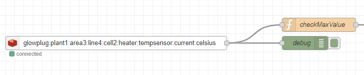

# Glowplug
**Glowplug** makes it easier to work with Sparkplug B data over MQTT for Industrial IoT (IIoT) applications.

## Why Glowplug?
If you're new to IIoT or industrial automation, Sparkplug data can be difficult to work with, and it's binary encoding is not human readable. Glowplug is designed to demystify Sparkplug data, by making every metric value more accessible and human readable. 

If you need to know the current value of a specific metric on your edge without talking to a MQTT broker, Glowplug makes it available for you in Redis. You can also subscribe to that value in Redis when it updates.

If you want individual metrics exposed in a UNS when they update, Glowplug can optionally publish them for you.

## Quickstart

```bash
docker run --network="host" aphexddb/glowplug:latest listen --broker mqtt://localhost:1883 --publish mqtt://localhost:1883
```

Or, if you have Go installed, install glowplug from the command line:

```bash
go install github.com/american-factory-os/glowplug@latest
glowplug listen --broker mqtt://localhost:1883 --publish mqtt://localhost:1883
```

Next, add a redis url to store current values:

```bash
glowplug listen --broker mqtt://localhost:1883 --redis redis://localhost:6379/0 --publish mqtt://localhost:1883
```

## Features

* MQTT Integration: Connect to your MQTT broker and listen for Sparkplug B messages.
* Sparkplug B Support: Consumes all Sparkplug v3.0 messages and topics
* Redis Support: Store the last known values of Sparkplug metrics in Redis, and optionally subscribe to changes.
* UNS compatible: Publishes to unique and consistent Redis keys and MQTT topic names.
* Human-readable: Optionally publish Sparkplug metrics to human-readable MQTT topics.

## MQTT
* The flag `--broker` contains the MQTT broker glowplug will listen for Sparkplug messages.
  * The value defaults to `mqtt://localhost:1883` (commonly used for [mosquitto](https://github.com/eclipse/mosquitto)).
* The flag `--publish` will publish each metrics to a unique topic in a UNS (more below on this).   
  * **Note:** this flag will generate a new topic in your broker for each Sparkplug metric published. If you have 100k's of tags there may be a compute impact.

### Example Usage
```bash
glowplug listen --broker mqtt://localhost:1883 --publish mqtt://localhost:1883
```
View your MQTT broker directly with [MQTT Explorer](https://mqtt-explorer.com/).

## Redis
* The flag `--redis` will specify the redis server for glowplug to store all Sparkplug metrics from birth and data messages in a [SET](https://redis.io/docs/latest/commands/set/), and publish them to a [channel](https://redis.io/docs/latest/commands/pubsub-channels/) of the same key as the set.

### Example Usage

```bash
glowplug listen --broker mqtt://localhost:1883 --redis redis://localhost:6379
```

You can explore glowplug data in Redis with [Redis Insight](https://redis.io/insight/). All data is prefixed with the value `glowplug`, so you can search for `glowplug:*` to see all the keys. Glowplug also stores all the metric data types it has seen in the hash `glowplug:metric_types`. 

If you are using [Node Red](https://nodered.org/), the [node-red-contrib-redis](https://flows.nodered.org/node/node-red-contrib-redis) module makes it easy to consume a redis channel containing Sparkplug metric data using [SUBSCRIBE](https://redis.io/docs/latest/commands/subscribe/).



## UNS Namespace

Glowplug ensures a consistent and unique namespace for all Redis keys, and MQTT topics. For example, given a Sparkplug payload (using the [parris method](https://www.hivemq.com/blog/implementing-unified-namespace-uns-mqtt-sparkplug/)) that contains a device metric of data type "Float" named "Current/Celsius":

* `spBv1.0/Plant1:Area3:Line4:Cell2/DDATA/Heater/TempSensor`

will be mapped as follows:

- **Redis SET key**:
    ```txt
    glowplug:plant1:area3:line4:cell2:heater:tempsensor:current:celsius
    ```
- **Redis channel key**:
    ```txt
    glowplug:plant1:area3:line4:cell2:heater:tempsensor:current:celsius
    ```    
- **MQTT Topic**:
    ```txt
    glowplug/Plant1/Area3/Line4/Cell2/Heater/TempSensor/Current/Celsius
    ```

## Sparkplug Go Module

Glowplug also includes a Go module for interacting with Sparkplug B protocol buffers. Install it with:

```bash
go get github.com/american-factory-os/glowplug/sparkplug
```

See `example/sparkplug_and_mqtt` for example usage.

